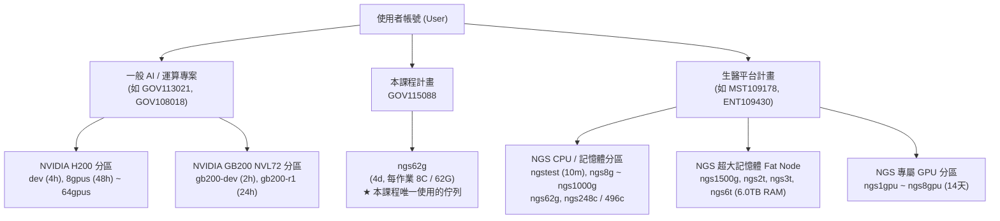
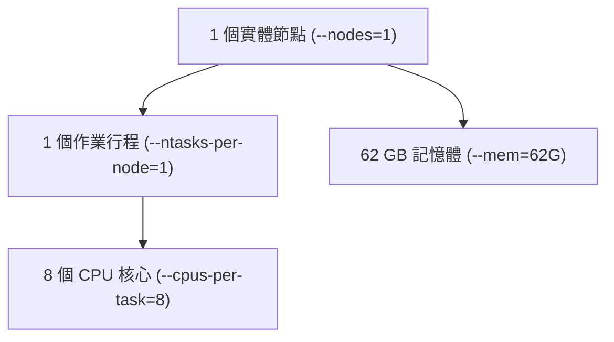

# 第 03 章：Slurm 語法精講與超級電腦作業調度實務 (晶創26 / Nano4 超算專屬)

本教學手冊全面解析在國網中心**晶創26（Nano4 / `nano4.nchc.org.tw`）**超級電腦叢集中最核心的資源排程系統 —— **Slurm (Simple Linux Utility for Resource Management)**。

本章以 GP1 生醫 NGS CPU 節點（`25a-cpn*`）與本課程的 `ngs62g` 佇列為主軸，進行系統化的語法剖析、實戰範本與除錯清單；H200 / GB200 GPU 節點與大記憶體節點的內容保留作為參考。

---


> [!NOTE]
> 本章範本位於教材 repository。若重新開啟終端機，先回到教材根目錄：
>
> ```bash
> cd "$HOME/Nano4-Docs"
> ```


> [!WARNING]
> 本次課程計畫為 **`GOV115088`**（國網生技醫藥高效能運算推廣與應用計畫）。本章其他 `GOV...`、`MST...` 代號都是說明用範例；日後使用自己的計畫時，必須以 `wallet` 和 association 查到的 project ID 取代，不能直接照抄。

> [!IMPORTANT]
> **本次課程採 CPU-only 配置。** 機房雖然有 H200/其他 GPU 節點，但本次不申請 GPU、
> 不使用 `dev`/`ngs1gpu`～`ngs8gpu`，Slurm 腳本也不加入 `--gres=gpu`。
> 本課程以 GP1 CPU 服務與 NGS CPU 分區為主：**`GOV115088` 在 NGS CPU 佇列中只允許使用 `ngs62g`**
> （官方規格：每個作業固定 **`-c 8 --mem=62G`**，最長 4 天；標準範例見第 3 節）。
> 日後使用其他計畫時，仍應以 `wallet`、association 和 `scontrol show partition` 驗證權限。
> 本章的 H200 / GB200 段落標示為「參考」，本次課程不操作。
> 官方 GP1 說明：[Nano4 生醫專用節點使用說明](https://man.twcc.ai/xOYzPATVS_aDlbuqMrwhyg)。


## 📌 目錄 (Table of Contents)
- [1. 為什麼需要 Slurm？排程器運作本質](#1-為什麼需要-slurm排程器運作本質)
- [2. Nano4 官方硬體規格與佇列分區表 (Partitions)](#2-nano4-官方硬體規格與佇列分區表-partitions)
  - [A. 計畫錢包餘額與帳號權限查詢 (`wallet` / `sacctmgr`)](#a-計畫錢包餘額與帳號權限查詢-wallet--sacctmgr)
  - [B. 專案類別與佇列分區對應架構 (Project vs. Partition)](#b-專案類別與佇列分區對應架構-project-vs-partition)
  - [C. Nano4 常用佇列清單與 QoS 限制](#c-nano4-常用佇列清單與-qos-限制)
- [3. Slurm 核心參數速查表 (#SBATCH Directives)](#3-slurm-核心參數速查表-sbatch-directives)
- [4. 資源配置關鍵四要素：Nodes、Tasks、CPUs 與 Memory](#4-資源配置關鍵四要素nodestaskscpus-與-memory)
- [5. 進階排程神器：陣列、相依性與 GPU 運算](#5-進階排程神器陣列相依性與-gpu-運算)
  - [A. 批次陣列作業 (Array Jobs)](#a-批次陣列作業-array-jobs)
  - [B. 流水線相依性作業 (Job Dependencies)](#b-流水線相依性作業-job-dependencies)
  - [C. NVIDIA H200 GPU 資源申請](#c-nvidia-h200-gpu-資源申請)
  - [D. 互動式除錯與即時開發 (`salloc` + `srun`)](#d-互動式除錯與即時開發-salloc--srun)
  - [E. 單節點 vs 跨節點 GPU 分散式運算架構與 Benchmark 迷思](#e-單節點-vs-跨節點-gpu-分散式運算架構與-benchmark-迷思)
- [6. 作業監控、效能分析 (seff) 與資源除錯](#6-作業監控效能分析-seff-與資源除錯)
- [7. HPC 容器化技術：Singularity / Apptainer 實務](#7-hpc-容器化技術singularity--apptainer-實務)
- [8. 初學者循序漸進實作演練 (Hands-on Labs)](#8-初學者循序漸進實作演練-hands-on-labs)
- [9. Nano4 常見踩坑與排錯清單 (Troubleshooting)](#9-nano4-常見踩坑與排錯清單-troubleshooting)

---

## 1. 為什麼需要 Slurm？排程器運作本質

在 Nano4 超級電腦叢集中：
* **數百位研究團隊** 同時使用數百台價值高昂的 GPU/CPU 伺服器（計算節點）。
* 若沒有排程機制，多人同時執行重度運算會導致記憶體耗盡（OOM）、CPU 搶佔，甚至癱瘓伺服器。

**Slurm 的核心任務：**
1. **佇列調度（Queueing）**：根據使用者的計畫配額（Account）與優先權分配節點與時間。
2. **資源隔離（Cgroups Isolation）**：保證您申請的 8 核心、62GB 記憶體或 1 張 H200 GPU 完全歸您專屬獨佔，不受其他使用者程式干擾。
3. **作業計費（Accounting）**：精準計算使用的 CPU/GPU 時間與服務點數（SU）。

> [!IMPORTANT]
> **🖥️ VS Code Remote-SSH 視角：為什麼需要 Slurm？**  
> 1. **VS Code 終端機運行在「登入節點」**：雖然在 VS Code 編輯程式極其流暢，但登入節點（`25a-lgn01~05`）是多人共用，嚴禁直接在終端機執行多核心重度運算（如大數據質控、模型訓練），否則會被系統守護程序強制 kill。  
> 2. **VS Code 是最完美的「Slurm 指揮調度中心」**：  
>    * **撰寫**：在 VS Code 編輯器中編寫 `.slurm` 腳本，享有語法高亮與 AI 自動補全。  
>    * **派送**：在整合式終端機（``Ctrl + ` ``）執行 `sbatch job.slurm`，將任務派往強大的計算節點。  
>    * **檢視**：作業完成後，直接在 VS Code 檔案總管雙擊開啟 `%x-%j.out` 日誌，即時分析輸出！

---

## 2. Nano4 官方硬體規格與佇列分區表 (Partitions)

Nano4 採用雙架構設計，包含 x86_64（Intel Xeon 8480+ 與 NVIDIA H200）以及 Arm aarch64（NVIDIA Grace Blackwell GB200 NVL72）。

### A. 計畫錢包餘額與帳號權限查詢 (`wallet` / `sacctmgr`)

在送出任何 Slurm 工作前，請先確認您的計畫代號（`PROJECT_ID` / `Account`）具有足夠的點數與排程權限：

```bash
# 1. 查詢名下所有計畫的點數餘額
wallet

# 2. 查詢特定計畫餘額 (速度較快)
wallet GOV115088

# 3. 查詢自己帳號在 Slurm 排程系統中綁定的授權 (Association)
sacctmgr -nP show assoc user="$(whoami)" format=Account,Partition,QOS
```

---

### B. 專案類別與佇列分區對應架構 (Project vs. Partition)

Nano4 具備非常嚴格的**專案類別佇列隔離機制**：



> [!CAUTION]
> **專案與佇列權限不可混用**：
> 1. 生醫平台計畫 `MST109178`、`ENT109430` 被一般 GPU 分區（如 `dev`）設定為 `DenyAccounts`，只能使用 `ngs*` 佇列。
> 2. 本課程計畫 `GOV115088` 在 NGS 佇列中**只列在 `ngs62g` 的 `AllowAccounts`**；送到 `ngstest`、`ngs32g`、`ngs250g`、`ngscourse*` 等會被拒絕。
> 3. 一般 AI 專案（如 `GOV113021`）無法派送至 `ngs62g` 等生醫專用分區。
> 4. 派送前可用 `scontrol show partition <PARTITION>` 檢查 `AllowAccounts` 與 `DenyAccounts`。

---

### C. Nano4 常用佇列清單與 QoS 限制

#### 1. NVIDIA H200 GPU 分區 (一般 AI / 大模型訓練專案)
| 佇列名稱 | 節點架構 | GPU 資源 | 最長執行時間 | 記憶體與核心標準 |
| :--- | :--- | :--- | :--- | :--- |
| **`dev`** | 25a-hgpn* (x86_64) | 1 ~ 8x H200 (141GB) | **4 小時** | 每 GPU 支援約 12 核心、200GB 記憶體 |
| **`8gpus`** | 25a-hgpn* (x86_64) | 8x H200 | **48 小時** (2天) | 單節點滿載 GPU 訓練 |
| **`16gpus` ~ `256gpus`** | 25a-hgpn* (x86_64) | 多節點跨機平行 | 12 ~ 48 小時 | 大規模分散式訓練 (Slurm + PyTorch DDP) |

> ⚠️ **H200 `dev` 必備條件**：QoS 要求最少必須申請 1 顆 GPU（`#SBATCH --gres=gpu:1`），不可申請 0 GPU。

#### 2. NVIDIA GB200 NVL72 分區 (Arm aarch64 新架構)
| 佇列名稱 | 節點架構 | GPU 資源 | 最長執行時間 | 說明與限制 |
| :--- | :--- | :--- | :--- | :--- |
| **`gb200-dev`** | 25a-ggpn* (Arm) | 1 ~ 2x Blackwell（單一計畫上限 2） | **2 小時** | GB200 除錯測試專用 |
| **`gb200-r1` / `r2`**| 25a-ggpn* (Arm) | NVL72 專屬 | 12 ~ 24 小時 | 高階 Blackwell 平行訓練 |

> ⚠️ **Arm 架構編譯提醒**：Nano4 登入節點為 x86_64，若軟體要在 GB200 上執行，必須透過 `salloc -p gb200-dev` 進入 Arm 計算節點進行編譯或建立虛擬環境！

#### 3. NGS 生技醫藥專用分區 (`ngs62g` 開放 `GOV115088`；其餘僅 `MST109178` / `ENT109430`)
| 佇列名稱 | 節點類型 | 核心數搭配 (`-c`) | 記憶體配置 (`--mem`) | 最長時間 | 適用任務 |
| :--- | :--- | :--- | :--- | :--- | :--- |
| **`ngstest`** | 25a-cpn* | **1 核心** | **8 GB** | **10 分鐘** | 快速語法除錯、微型測試 |
| **`ngsconsole`**| 25a-cpn* | **1 核心** | **8 GB** | **不限時** | 互動式命令列操作 |
| **`ngs62g`** (本課程)| 25a-cpn* | **8 核心** | **62 GB**（固定規格） | **4 天** (96h) | **本課程唯一使用的分區 (FASTQ QC, Amplicon)** |
| **`ngs250g` / `500g`**| 25a-cpn* | 32~64 核心 | 250 ~ 500 GB | **不限時** | 基因體比對、Variant Calling |
| **`ngs248c` / `496c`**| 25a-cpn* | **124×2 / 124×4** | 不設限 | **不限時** | 大規模 CPU 基因體平行運算 |
| **`ngs1500g` ~ `ngs6t`**| 25a-mpn* (Fat) | 32～124 核心 | **1.5～6.0 TB** | **不限時** | **巨量記憶體組裝 (De novo assembly)** |
| **`ngs1gpu` ~ `ngs8gpu`**| 25a-hgpn* | 12～96 核心 | **200～1600 GB** | **14 天** | 生醫專屬 GPU（本次課程不使用） |

> [!WARNING]
> **💥 國網 Nano4 初學者第一大坑：`ngs62g` 記憶體未指定直接報錯！**  
> 國網官方規定 `ngs62g` 必須以固定搭配 **`-c 8 --mem=62G`** 申請（單一作業 CPU 8 核心、記憶體 62 GB）。  
> 若您在腳本中**漏寫** `#SBATCH --mem=...`，Slurm 預設會為您申請「整台節點的記憶體 (1024 GB)」，導致作業因超出 QoS 限制而被排程器拒絕或永遠處於 `(QOSMaxMemoryPerJob)` 排隊狀態！  
> **解決方案**：在 `ngs62g` 作業中**務必明確指定** `#SBATCH --cpus-per-task=8` 與 `#SBATCH --mem=62G`（官方規格，不自行縮減）！

---

## 3. Slurm 核心參數速查表 (#SBATCH Directives)

### 本課程標準範例：`ngs62g`（依國網官方規格）

國網 [GP1 生醫專用節點使用說明](https://man.twcc.ai/xOYzPATVS_aDlbuqMrwhyg) 規定：每個佇列都必須以表中固定的「核心數 × 記憶體」搭配申請。本課程所有範例一律使用 `ngs62g` 的官方規格 **`-c 8 --mem=62g`**：

| Partition | 記憶體配置 (`--mem`) | 核心數搭配 (`-c`) | 時間限制 | 個人 Job 上限 |
| :--- | :---: | :---: | :---: | :---: |
| `ngs62g` | 62G | 8 | 96 hrs | 120 |

官方範例（計畫代號換成本課程的 `GOV115088`）：

```bash
#!/usr/bin/sh
#SBATCH -A GOV115088        # Account name/project number (官方範例為 MST109178)
#SBATCH -J Job_name         # Job name
#SBATCH -p ngs62g           # Partition Name 等同PBS裡面的 -q Queue name
#SBATCH -c 8                # 使用的core數 請參考Queue資源設定
#SBATCH --mem=62g           # 使用的記憶體量 請參考Queue資源設定
#SBATCH -o out.log          # Path to the standard output file
#SBATCH -e err.log          # Path to the standard error output file
#SBATCH --mail-user=XXXX@niar.org.tw    # email
#SBATCH --mail-type=BEGIN,END           # 指定送出email時機 可為NONE, BEGIN, END, FAIL, REQUEUE, ALL

echo 'Hello world!'  ## 這邊寫入你要執行的指令
```

本手冊的範本另外做了兩處調整，其餘完全依官方規格：
- 日誌改用 `#SBATCH --output=%x-%j.out` / `--error=%x-%j.err`，檔名帶作業名稱與 Job ID，多次提交也不會互相覆蓋。
- 執行內容第一行加入 `module purge`，再載入所需模組。

### 參數速查表

在批次腳本開頭，以 `#SBATCH` 開頭的指令會被 Slurm 解析：

| 參數語法 | 簡寫 | 功能說明 | Nano4 實戰範例 |
| :--- | :--- | :--- | :--- |
| `#SBATCH --account=<ID>` | `-A` | 指定計費計畫代號 (iService Project ID) | `--account=GOV115088`（本課程）；GPU 參考：`GOV113021` |
| `#SBATCH --job-name=<NAME>` | `-J` | 定義作業名稱 (顯示於 squeue) | `--job-name=fastq_qc` |
| `#SBATCH --partition=<NAME>` | `-p` | 指定排程分區 | `--partition=ngs62g`（本課程）；GPU 參考：`dev` |
| `#SBATCH --nodes=<N>` | `-N` | 申請的實體節點數量 (單機多線程填 1) | `--nodes=1` |
| `#SBATCH --ntasks-per-node=<N>` | | 每個節點執行的行程（Process）數 | `--ntasks-per-node=1` |
| `#SBATCH --cpus-per-task=<N>` | `-c` | 每個行程分配的 CPU 核心數（多執行緒） | `--cpus-per-task=8` (ngs62g 官方規格) |
| `#SBATCH --mem=<SIZE>` | | **【必填】分配總記憶體大小** | `--mem=62G` (ngs62g 官方規格) |
| `#SBATCH --gres=gpu:<N>` | | 申請 GPU 數量 (GPU 分區專用) | `--gres=gpu:1` (H200 分區必備) |
| `#SBATCH --time=<D-HH:MM:SS>` | `-t` | 最長運行時間上限 (Walltime) | `--time=00:30:00` (30分鐘) |
| `#SBATCH --output=<FILE>` | `-o` | 標準輸出日誌路徑 | `--output=%x-%j.out` |
| `#SBATCH --error=<FILE>` | `-e` | 標準錯誤日誌路徑 | `--error=%x-%j.err` |
| `#SBATCH --mail-type=<TYPE>` | | 觸發 Email 通知的時機 | `--mail-type=END,FAIL` |
| `#SBATCH --mail-user=<EMAIL>` | | 接收通報的電子郵件信箱 | `--mail-user=user@example.com` |

> **日誌通配符（Tokens）說明**：
> * `%x`：作業名稱（Job Name）
> * `%j`：作業流水號 ID（Job ID）
> * `%A`：陣列作業主 ID
> * `%a`：陣列作業子任務序號

---

## 4. 資源配置關鍵四要素：Nodes、Tasks、CPUs 與 Memory

許多初學者容易混淆資源配置參數：



1. **單機多執行緒程式（Python multiprocessing, FastQC, OpenMP）**：
   * 範例：申請 1 節點、跑 1 個行程、使用 8 個執行緒、配給 62GB 記憶體（生醫純 CPU 分區 `ngs62g` 官方規格）。
   ```bash
   #SBATCH --account=GOV115088
   #SBATCH --partition=ngs62g
   #SBATCH --nodes=1
   #SBATCH --ntasks-per-node=1
   #SBATCH --cpus-per-task=8
   #SBATCH --mem=62G
   ```
2. **GPU 加速作業（PyTorch / TensorFlow / vLLM）【參考，本次課程不操作】**：
   * 範例：申請 1 節點、1 張 H200 GPU、12 核心、64GB 記憶體（需一般 AI 計畫）。
   ```bash
   #SBATCH --partition=dev
   #SBATCH --nodes=1
   #SBATCH --ntasks-per-node=1
   #SBATCH --cpus-per-task=12
   #SBATCH --gres=gpu:1
   #SBATCH --mem=64G
   ```

---

## 5. 進階排程神器：陣列、相依性與 GPU 運算

### A. 批次陣列作業 (Array Jobs)
當有 10 個 FASTQ 檔案需要批次處理時，不需要寫 10 份腳本，使用 `--array` 一次派送：

```bash
#SBATCH --partition=ngs62g
#SBATCH --cpus-per-task=8
#SBATCH --mem=62G
#SBATCH --array=1-10%4        # 總共 10 個任務，%4 代表最多同時平行執行 4 個
#SBATCH --output=%x-%A_%a.out # %A 為主作業ID, %a 為子任務序號 (1~10)

# 在腳本中透過 ${SLURM_ARRAY_TASK_ID} 取得當前處理序號
SAMPLE=$(sed -n "${SLURM_ARRAY_TASK_ID}p" sample_list.txt)
echo "正在處理樣本: ${SAMPLE}"
```
（`sample_list.txt` 為示意檔：每行一個樣本名稱，第 N 個子任務讀第 N 行。）
*(參考範本：[`templates/array_job.slurm`](./templates/array_job.slurm))*

---

### B. 流水線相依性作業 (Job Dependencies)
利用 `--dependency=afterok:<JOB_ID>` 建立前後相依的自動化工作流（Pipeline）：

```bash
# 步驟 1：送出資料前處理任務 (--parsable 只輸出 Job ID)
JOB1=$(sbatch --parsable --account=GOV115088 stage1_preprocess.slurm)

# 步驟 2：只有在 JOB1 成功結束 (afterok) 時，才啟動步驟 2
JOB2=$(sbatch --parsable --dependency=afterok:${JOB1} --account=GOV115088 stage2_qc.slurm)

# 步驟 3：步驟 2 完成後，自動產出統計報告
sbatch --dependency=afterok:${JOB2} --account=GOV115088 stage3_report.slurm
```
（`stage*_*.slurm` 為示意檔名；Lab 5 的 `workflow_dependency.sh` 以同一支 `standard_cpu_job.slurm` 代表三個階段。）
*(參考範本：[`templates/workflow_dependency.sh`](./templates/workflow_dependency.sh))*

---

### C. NVIDIA H200 GPU 資源申請

> 📎 參考內容，本次 CPU-only 課程不操作（需一般 AI 計畫的 GPU 權限）。

在 Nano4 的 H200 佇列（`dev` 或 `8gpus`）：
```bash
#SBATCH --account=GOV113021
#SBATCH --partition=dev
#SBATCH --nodes=1
#SBATCH --cpus-per-task=12
#SBATCH --mem=64G
#SBATCH --gres=gpu:1          # 申請 1 顆 NVIDIA H200
#SBATCH --time=01:00:00
```
*(參考範本：[`templates/gpu_job.slurm`](./templates/gpu_job.slurm))*

---

### D. 互動式除錯與即時開發 (`salloc` + `srun`)
當您需要即時除錯或測試程式，不想每次都透過 `sbatch` 排隊看 log 時，可透過 `salloc` 申請計算節點並進入即時互動式 Shell：

```bash
# 案例 1：申請生醫 ngs62g 分區 8 核心、62GB 記憶體 (官方規格，限時 30 分鐘)
salloc --account=GOV115088 --partition=ngs62g --nodes=1 --cpus-per-task=8 --mem=62G --time=00:30:00 srun --pty /bin/bash

# 案例 2（參考，本次課程不操作）：申請一般 AI dev 分區 1 顆 H200 GPU、12 核心、64GB 記憶體 (限時 1 小時)
salloc --account=GOV113021 --partition=dev --nodes=1 --cpus-per-task=12 --gres=gpu:1 --mem=64G --time=01:00:00 srun --pty /bin/bash
```
*(參考輔助腳本：[`scripts/interactive_salloc.sh`](./scripts/interactive_salloc.sh))*

---

### E. 單節點 vs 跨節點 GPU 分散式運算架構與 Benchmark 迷思

> 📎 參考內容，本次 CPU-only 課程不操作。


在深度學習或大數據運算中，初學者常有一個直覺迷思：「**節點開越多、機器數量越多，運算速度一定越快？**」  
答案是：**完全不一定！如果配置不當，跨節點反而會大幅拖慢運算速度！**

#### 1. 硬體架構與通訊成本本質

| 比較維度 | 單節點運算 (Single-Node) | 跨節點分散式運算 (Multi-Node / Distributed) |
| :--- | :--- | :--- |
| **物理機器** | 所有 GPU/CPU 位於同一台物理主機內 | 計算分散於 2 台或以上的獨立伺服器 |
| **記憶體架構** | **共用記憶體 (Shared Memory)**<br>透過主機板內部 NVLink / PCIe 匯流排互聯 | **分散式記憶體 (Distributed Memory)**<br>每個節點有獨立記憶體，跨機存取必須透過網路線 |
| **通訊成本** | 晶片內直通，延遲僅微秒級，頻寬高達數百 GB/s | 透過 InfiniBand (IB 400Gb/s) 網路線打包傳遞，**通訊延遲比晶片內存取慢數十到數百倍**！ |

#### 2. 國網中心官方真實 Benchmark 警世數據 (實測對比)

以下為國網中心晶創超算環境官方實測 PyTorch DDP 訓練之真實數據：

| 運算規模場景 | 單節點配置 | 跨節點配置 | 效能差異與深度剖析 |
| :--- | :--- | :--- | :--- |
| **小型運算**<br>(小型模型 / 小 Batch) | **單節點 2 顆 GPU**<br>耗時：**13 秒** | **2 節點各 1 顆 GPU**<br>耗時：**88 秒** | 💥 **跨節點慢了近 7 倍！**<br>因為小任務的計算時間太短，全部時間都耗費在節點間的網路交握與梯度同步通訊開銷（Communication Overhead）。 |
| **大型運算**<br>(大型模型 / 大 Batch) | 單節點 8 顆 GPU<br>耗時：**78 秒** | **2 節點各 4 顆 GPU**<br>耗時：**29 秒** | 🚀 **跨節點加速 2.7 倍！**<br>當單一步驟的矩陣計算強度遠大於傳輸開銷時，分散式並行運算才能真正發揮強大加速效益！ |

#### 3. 實務選擇黃金準則
1. **優先使用單節點運算**：  
   Nano4 的 H200 節點單台即具備 **8 張 H200 GPU（共 1,128GB HBM3e 顯存）與 2TB 系統記憶體**。若模型與資料能容納於單一節點內，**請 100% 優先使用單節點（1~8 GPUs）**，點數最省、通訊零損耗、速度最快！
2. **何時才需要跨節點？**  
   - 單節點記憶體真的爆了（如百億/千億參數 LLM 全量微調、超大規模氣象/流體模擬）。
   - 運算時間長達數週以上，且演算法通訊強度低、易於資料平行切分。

#### 4. 標準跨節點 PyTorch DDP / `torchrun` Slurm 腳本範本
跨節點訓練時，Slurm 必須動態取得主節點（Master Node）的 IP 位址與通訊埠：

```bash
#!/bin/bash
#SBATCH --account=GOV113021
#SBATCH --job-name=multi_node_ddp
#SBATCH --partition=dev
#SBATCH --nodes=2
#SBATCH --gpus-per-node=1
#SBATCH --ntasks-per-node=1
#SBATCH --cpus-per-task=12
#SBATCH --time=01:00:00
#SBATCH --output=%x-%j.out
#SBATCH --error=%x-%j.err

module purge
module load singularity

# 1. 動態取得第一個計算節點作為 Master 節點 IP
MASTER_ADDR=$(scontrol show hostnames $SLURM_JOB_NODELIST | head -n1)
MASTER_PORT=29500

echo "Master Node Address: ${MASTER_ADDR}:${MASTER_PORT}"

# 2. 透過 srun 同時在所有節點啟動 torchrun
srun singularity exec --nv /work/${USER}/pytorch.sif torchrun \
    --nnodes=$SLURM_NNODES \
    --nproc_per_node=1 \
    --rdzv_backend=c10d \
    --rdzv_endpoint=${MASTER_ADDR}:${MASTER_PORT} \
    train_distributed.py
```

---

## 6. 作業監控、效能分析 (seff) 與資源除錯

### A. 常用排程管理指令表

| 操作目標 | 指令語法 | 說明 |
| :--- | :--- | :--- |
| **提交作業** | `sbatch job.slurm` | 將作業送入排程佇列 |
| **查看個人作業** | `squeue -u $(whoami)` | 查詢排隊中 (`PD`) 或執行中 (`R`) 的任務 |
| **取消單一作業** | `scancel <JOB_ID>` | 中止指定作業並釋放資源 |
| **取消個人所有作業** | `scancel -u $(whoami)` | 一鍵終止自己所有運行中的作業 |
| **查看作業詳細資訊** | `scontrol show job <JOB_ID>` | 查看工作目錄、節點分配、運行時間與錯誤原因 |
| **查詢歷史作業紀錄** | `sacct -j <JOB_ID> --format=JobID,JobName,State,Elapsed,MaxRSS` | 查詢已結束作業的記憶體峰值 (MaxRSS) 與退出碼 |
| **查詢分區空閒狀態** | `sinfo -p ngs62g` | 查看特定 Queue 節點空閒狀況 (idle / alloc) |

> [!WARNING]
> **⚠️ 國網中心官方鐵律：嚴禁使用 `watch` 或程式迴圈高頻輪詢 `squeue`！**  
> 官方明文警告：**「禁用 watch 指令或程式迴圈搭配 squeue，這會大幅增加排程系統資料庫負擔。建議改用電子郵件通知機制。」**  
> 推薦在批次腳本中加入：
> ```bash
> #SBATCH --mail-type=END,FAIL
> #SBATCH --mail-user=your_email@domain.com
> ```

---

### B. 作業狀態代碼完整速查 (Job State Codes)

在透過 `squeue` 或 `sacct` 查詢作業時，系統會顯示狀態縮寫。以下為國網中心超算常用狀態碼與排錯指引：

| 狀態縮寫 | 完整狀態名 | 說明與排錯指引 |
| :---: | :--- | :--- |
| **`PD`** | **PENDING** | **等待中**：作業正在排隊等待資源分配。可查看 `NODELIST(REASON)` 得知排隊原因（如 Priority 或 Resources）。 |
| **`R`** | **RUNNING** | **執行中**：作業已分配到計算節點並正在運算。 |
| **`CF`** | **CONFIGURING** | **配置中**：資源已分配，節點正在載入環境與初始化（通常轉瞬即逝）。 |
| **`CG`** | **COMPLETING** | **完成中**：作業主體已結束，系統正在執行尾端清理或等待跨節點進程同步退出。 |
| **`CD`** | **COMPLETED** | **已完成**：作業所有步驟皆正常結束，ExitCode 為 0。 |
| **`F`** | **FAILED** | **失敗中止**：程式執行發生非 0 錯誤退出。請檢視 `%x-%j.err` 查看 Python 或 Shell 報錯訊息。 |
| **`TO`** | **TIMEOUT** | **逾時終止**：作業執行時間超過了 `#SBATCH --time` 所設定的時間上限。請加大時間或最佳化程式。 |
| **`CA`** | **CANCELLED** | **已取消**：使用者透過 `scancel` 主動取消，或管理員排程維護中止。 |
| **`NF`** | **NODE_FAIL** | **節點硬體故障**：非使用者腳本問題！計算節點底層硬體異常，請向國網客服通報重新派送。 |
| **`BF`** | **BOOT_FAIL** | **節點開機失敗**：節點初始化硬體失敗，非使用者問題。 |
| **`PR`** | **PREEMPTED** | **資源被強佔**：佇列資源被更高優先等級之系統任務或預約作業強佔。 |
| **`SE`** | **SPECIAL_EXIT**| **特殊退出重排**：作業因特定環境訊號退出並重新排隊。 |
| **`ST`** | **STOPPED** | **已暫停**：作業收到 `SIGSTOP` 訊號暫停，仍保留原本資源配額。 |

---

### C. 核心效能診斷神器：`seff` (避免浪費計畫點數)

作業執行完畢後，執行官方效能分析工具：
```bash
seff <JOB_ID>
```

**輸出範例解密：**
```text
Job ID: 1073764
State: COMPLETED (exit code 0)
Nodes: 1
Cores per node: 8
CPU Utilized: 00:06:24
CPU Efficiency: 80.00% of 00:08:00 core-walltime
Memory Utilized: 2.15 GB
Memory Efficiency: 3.47% of 62.00 GB
```

> 記憶體效率偏低在 `ngs62g` 是正常現象：本課程依官方規格固定申請 `-c 8 --mem=62G`，**不要**因為 seff 顯示用量少就自行調降 `--mem` 或 `-c`。要看的重點是 CPU 效率：8 核心有沒有被程式用滿。

**🔍 兩大常見資源浪費與除錯解法：**
1. **CPU 效率太低 (CPU Efficiency < 20%)**：
   - **原因**：申請了多核心（例如 `--cpus-per-task=8`），但執行的程式僅支援單執行緒（未開平行化），白白浪費了 7 核心的 SU 計費點數！
   - **優化**：`ngs62g` 依官方規格固定申請 8 核心，因此應修改程式啟用多核心平行運算（例如 `fastqc -t 8`、`${SLURM_CPUS_PER_TASK}`），把 8 核心用滿。
2. **記憶體溢出崩潰 (OOM - Out of Memory, ExitCode 137)**：
   - **原因**：程式使用的記憶體超過了 `--mem` 申請的配額，被 Linux 核心 OOM Killer 強制終止。
   - **解法**：`ngs62g` 已固定為 62G，無法再加大；請減少單一作業的資料量，或拆成多個作業（例如 array job）。若單一步驟本身就需要更多記憶體，需改用 `MST109178` 等生醫平台計畫申請大記憶體分區（如 `ngs250g` 或 `ngs2t`（2 TB）～`ngs6t`（6 TB））。

---

## 7. HPC 容器化技術：Singularity / Apptainer 實務

在 HPC 多用戶叢集中，基於資安考量嚴禁使用 Docker（需要 root 權限）。**Singularity (Apptainer)** 是超級電腦上唯一被廣泛採用的無 root 容器技術！

> [!TIP]
> **🌐 Nano4 計算節點外網直連優勢**：  
> Nano4 的計算節點預設具備直連網際網路的能力，因此在計算節點上執行 Singularity 容器時，可直接從 Docker Hub、Quay.io 或 Hugging Face 下載映像檔或資料，**無需設定任何 HTTP Proxy 代理隧道**！

### A. 常用指令快速上手
* **將 Docker 鏡像轉換為 SIF 檔（存放在高速 `/work`）**：
  ```bash
  singularity pull /work/${USER}/ubuntu_22.04.sif docker://ubuntu:22.04
  ```
* **在容器中執行指令 (掛載 `/work` 高速目錄)**：
  ```bash
  singularity exec -B /work/${USER}:/mnt /work/${USER}/ubuntu_22.04.sif ls /mnt   # 在容器內列出掛載的 /work 目錄
  ```
* **GPU 深度學習支援 (啟用 `--nv`)**：
  ```bash
  singularity exec --nv -B /work/${USER}:/mnt pytorch.sif python3 -c "import torch; print('GPU 可用:', torch.cuda.is_available())"
  ```

---

## 8. 初學者循序漸進實作演練 (Hands-on Labs)

針對剛接觸超級電腦排程的初學者，請依序完成以下 7 個動手實驗（Lab 3 為 GPU 參考，本次課程跳過）。所有 Lab 都在本章目錄執行：

```bash
cd "$HOME/Nano4-Docs/03-slurm-syntax-and-job-management"
```

### 🧪 Lab 1：查詢個人專案錢包與可用的排程分區
1. 查詢自己的可用點數：
   ```bash
   wallet
   ```
2. 查詢當前登入節點可見的 Slurm 分區狀態：
   ```bash
   ./scripts/slurm_status.sh
   ```
3. 查看生醫主力佇列 `ngs62g` 的詳細政策：
   ```bash
   scontrol show partition ngs62g
   ```

---

### 🧪 Lab 2：提交第一個 Nano4 標準 CPU 批次作業
1. 檢視標準作業範本：
   ```bash
   cat templates/standard_cpu_job.slurm
   ```
2. 使用生醫計畫代號提交作業：
   ```bash
   sbatch --account=GOV115088 templates/standard_cpu_job.slurm
   ```
3. 觀察作業狀態（可能先顯示 `PD` 排隊，接著變成 `R`；作業結束後會從清單中消失，這時就可以查看日誌）：
   ```bash
   squeue -u $(whoami)
   ```
4. 查看輸出日誌：
   ```bash
   ls -la cpu_job-*.out
   cat cpu_job-*.out
   ```

---

### 🧪 Lab 3：提交 NVIDIA H200 GPU 測試作業【參考，本次課程跳過】

> 此 Lab 需要一般 AI 計畫（如 `GOV113021`）的 GPU 權限，本次 CPU-only 課程不操作。
1. 檢視 GPU 作業範本：
   ```bash
   cat templates/gpu_job.slurm
   ```
2. 使用一般 AI 計畫代號提交作業至 `dev` 分區：
   ```bash
   sbatch --account=GOV113021 templates/gpu_job.slurm
   ```
3. 檢查輸出日誌中是否成功偵測到 NVIDIA H200 GPU 與 `nvidia-smi` 資訊：
   ```bash
   cat gpu_h200_job-*.out
   ```

---

### 🧪 Lab 4：批次平行陣列作業演練 (Array Jobs)
1. 提交 10 個平行子任務（最多同時跑 4 個）：
   ```bash
   sbatch --account=GOV115088 templates/array_job.slurm
   ```
2. 觀察多個子任務如何排隊與執行：
   ```bash
   squeue -u $(whoami)
   ```
3. 任務完成後，檢視不同子任務的專屬日誌：
   ```bash
   ls -la array_job-*.out
   ```

---

### 🧪 Lab 5：自動化相依流水線串接 (Job Dependency)
1. 執行相依性自動串接腳本：
   ```bash
   bash templates/workflow_dependency.sh
   ```
2. 查看佇列狀態，注意後續階段的狀態為 `(Dependency)` 等待前一階段完成：
   ```bash
   squeue -u $(whoami)
   ```

---

### 🧪 Lab 6：啟動即時除錯互動終端 (`salloc`)
1. 執行互動式登入輔助腳本：
   ```bash
   ./scripts/interactive_salloc.sh GOV115088 ngs62g 8 00:10:00 62G
   ```
2. 進入節點後，觀察主機名稱是否切換為計算節點（如 `25a-cpn*`）：
   ```bash
   hostname
   free -h
   ```
3. 測試完畢後，輸入 `exit` 退出計算節點並釋放資源。

---

### 🧪 Lab 7：使用 `seff` 診斷作業利用率
針對前面完成的任何一個 Job ID，執行效能診斷：
```bash
seff <JOB_ID>
```
確認 CPU 與 Memory 利用率，體驗 HPC 資源優化的核心理念！

---

## 9. Nano4 常見踩坑與排錯清單 (Troubleshooting)

### Q1: 提交作業時報錯 `Batch job submission failed: Invalid account or account/partition combination specified`
* **原因**：您指定的 `--account` 沒有該 `--partition` 的使用權限（例如用 `GOV115088` 派送至 `ngstest`、`ngs32g`，用 `MST109178` 派送至 H200 `dev`，或用一般 AI 專案派送至 `ngs62g`）。
* **檢查方法**：
  ```bash
  sacctmgr -nP show assoc user="$(whoami)" format=Account,Partition
  scontrol show partition <PARTITION_NAME> | grep -E "AllowAccounts|DenyAccounts"
  ```

---

### Q2: 作業狀態一直顯示 `PD` (Pending)，原因為 `(QOSMaxMemoryPerJob)`
* **原因**：在 `ngs62g` 分區漏寫了 `#SBATCH --mem=...`，Slurm 預設申請整台節點 1024GB 記憶體，超過了 `ngs62g` QoS 的 62GB 限額！
* **解法**：依官方規格在腳本開頭加上 `#SBATCH --cpus-per-task=8` 與 `#SBATCH --mem=62G`。

> [!NOTE]
> `sbatch --test-only` 只會檢查帳號、分區與語法能否被接受，**不會檢查 QoS 上限**。例如在 `ngs62g` 申請 `--cpus-per-task=12`，`--test-only` 仍會回報可排程，實際提交後卻會卡在 `QOSMaxCpuPerJobLimit`。資源數字請自行對照上方的佇列限制表。

---

### Q3: 提交至 `dev` 分區時報錯 `Job violates accounting/QOS policy (job submit limit, user's value and script limit: 0 < 1)`
* **原因**：在 Nano4 H200 `dev` 分區中，QoS 設定最少必須申請 1 顆 GPU（`MinTRES=gres/gpu:1`）。
* **解法**：在腳本開頭加上 `#SBATCH --gres=gpu:1`。

---

### Q4: 作業瞬間消失或失敗，日誌出現 `_open_output_file: No such file or directory`
* **原因**：在 `#SBATCH --output=logs/%x-%j.out` 中指定了 `logs/` 資料夾，但提交作業的當前目錄並未建立該資料夾。
* **解法**：在提交前先 `mkdir -p logs`，或直接使用 `--output=%x-%j.out`。

---

> 💡 **從排程指令到生物資訊與 AI Agent 實戰 (Roadmap)**：  
> 掌握了 Nano4 的 Slurm 基礎語法與 `ngs62g` 分區規格後，下一步我們將進階至真實生物資訊資料處理！  
> 在下一章中，我們將結合 VS Code、AI 輔助與 Slurm，在登入節點以微型資料完成 FASTQ 質控（FastQC / MultiQC）；完整的 16S 擴增子分析則在第 07 章進行。

👉 **下一課**：[第 04 章：AI 輔助生醫質控管線](../04-ai-assisted-bio-pipeline/)
