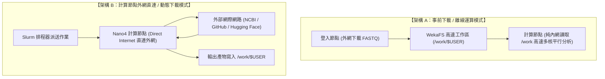

# 第 05 章：AI Agent 自動化 Slurm 排程重構與批次派送實戰 (Nano4 雙實戰案例)

本教學手冊展示如何引導 **AI Agent（Antigravity 內建 Agent / Codex / Claude Code）**，將第 04 章 §5 在登入節點手動執行的互動式生醫分析管線，自動重構並封裝為生產級的 **Slurm 批次排程作業**，同時完整實作 **「事前下載離線運算」** 與 **「計算節點外網直連動態下載」** 兩種關鍵生產環境架構。

---


> [!NOTE]
> 本章實作檔案位於教材 repository。若重新開啟終端機，先回到教材根目錄：
>
> ```bash
> cd "$HOME/Nano4-Docs"
> ```

## 📌 目錄 (Table of Contents)
- [1. 為什麼要將腳本派送至 Slurm 佇列？](#1-為什麼要將腳本派送至-slurm-佇列)
- [2. 請 AI Agent 自動重構 Slurm 腳本 (Prompt 技巧)](#2-請-ai-agent-自動重構-slurm-腳本-prompt-技巧)
- [3. Nano4 兩大運算架構對比：離線運算 vs 外網直連](#3-nano4-兩大運算架構對比離線運算-vs-外網直連)
- [4. 實戰案例 A：事前資料下載 / 高速離線運算模式](#4-實戰案例-a事前資料下載--高速離線運算模式)
- [5. 實戰案例 B：計算節點外網直連 / 動態下載模式](#5-實戰案例-b計算節點外網直連--動態下載模式)
- [6. 結果檢驗、效能分析 (seff) 與成果匯總](#6-結果檢驗效能分析-seff-與成果匯總)
- [7. 課程進度回顧與後續章節](#7-課程進度回顧與後續章節)

---

## 1. 為什麼要將腳本派送至 Slurm 佇列？

第 04 章 §5 的對照組在登入節點執行 `run_fastqc_multiqc.sh`，處理小量 FASTQ 質控。然而：
* 登入節點（`25a-lgn01~05`）是多人共用，系統 Cgroups 限制個人 CPU 與記憶體，嚴禁執行長時間或高資源運算。
* 只有將任務打包送入 **Slurm 計算節點 (Compute Node)**，才能申請：
  * **多核心 CPU**（本課程計畫 `GOV115088` 使用 `ngs62g`，每個作業固定 8 核心；生醫平台計畫另可用 `ngs248c`/`ngs496c` 數百核）。
  * **大容量記憶體**（`ngs62g` 每個作業固定 62 GB；生醫平台計畫另可用高達 **6 TB** 的 `ngs6t`）。
  * 一般 AI 計畫另可申請 **NVIDIA H200 / GB200 GPU**（本次 CPU-only 課程不使用）。

---

## 2. 請 AI Agent 自動重構 Slurm 腳本 (Prompt 技巧)

在 Antigravity 以 `$HOME/Nano4-Docs` 為工作資料夾，開啟任一個 Agent（Antigravity 內建 Agent、Codex 或 Claude Code）。三個 Agent 都會讀到 Nano4 規則（Codex 讀 `AGENTS.md`、Claude Code 讀匯入 `AGENTS.md` 的 `CLAUDE.md`、Antigravity 讀 `.agents/rules/nano4.md`，見第 02 章 §4）；不確定時，在對話開頭要求它「先閱讀 AGENTS.md」。第二堂做好的 `my-nano4-slurm` 與 `Nano4-Docs/.agents/skills/` 裡的課程 Skills 也會一起載入。無論使用哪個 Agent，prompt 中仍請明確寫出 `ngs62g` 與 `-c 8 --mem=62G`：

```text
你是一位熟悉國網中心 Nano4 (晶創26) 超級電腦 Slurm 排程器與生物資訊分析的專家。
我原本在登入節點有一個執行 FASTQ 質控分析（FastQC + MultiQC）的互動腳本 `run_fastqc_multiqc.sh`。
現在我希望將這套流程改由 Slurm 佇列派送到 Nano4 計算節點（Compute Node）執行。

請幫我編寫兩個版本的 Slurm 批次作業腳本（符合 Nano4 規格，本課程計畫使用 #SBATCH --account=GOV115088 與 --partition=ngs62g，並依 ngs62g 官方規格加上 #SBATCH --cpus-per-task=8 與 #SBATCH --mem=62G）：

1. 案例 A：事前資料下載 / 離線運算模式 (資料已在 /work 高速目錄就緒，計算節點純內網多核平行處理)。
2. 案例 B：外網直連 / 動態下載模式 (利用 Nano4 計算節點 Direct Internet 存取能力，即時抓取遠端資料並質控)。
```
*(完整提示詞可參考 [`prompts/ai_prompt_convert_to_slurm.md`](./prompts/ai_prompt_convert_to_slurm.md))*

---

## 3. Nano4 兩大運算架構對比：離線運算 vs 外網直連



| 評估項目 | 案例 A：事前下載離線運算 | 案例 B：計算節點外網直連動態下載 |
| :--- | :--- | :--- |
| **外部網路需求** | 計算節點完全不發起連線 | 計算節點直接對外連線 (Direct Internet) |
| **Proxy 需求** | ❌ 完全不需要 | ❌ **Nano4 自帶外網，完全不需要 Proxy** |
| **資料準備時機** | 提交 Slurm 作業前已完整就緒 | Slurm 作業開始執行時由節點內部動態拉取 |
| **最佳適用場景** | 大規模長期定序專案、固定生物參考基因組比對 | 即時動態抓取、模型權重即時下載、日誌推播至 WandB |
| **執行穩定度** | ⭐ 穩定度最高 (不受外部網路波動影響) | 高 (依賴外部伺服器連線順暢) |

---

## 4. 實戰案例 A：事前資料下載 / 高速離線運算模式

### 步驟 1：在登入節點準備好資料
在登入節點執行下載腳本，將小型示範資料存入個人高速工作區 `/work/${USER}`：
```bash
cd "$HOME/Nano4-Docs/05-ai-agent-slurm-pipeline/case_a_offline"
bash 01_download_on_login_node.sh
```

### 步驟 2：提交純離線 Slurm 計算作業

本課程計畫為 `GOV115088`（範本已預設）；若日後使用其他生醫計畫，改設 `BIO_PROJECT_ID` 即可，命令列的 `--account` 會覆寫範本中的設定。

```bash
export BIO_PROJECT_ID=GOV115088
sbatch --account="${BIO_PROJECT_ID}" 02_submit_offline_qc.slurm
```
**Slurm 執行腳本重點解密**：
* 申請生醫佇列：`#SBATCH --partition=ngs62g`
* 指定計費專案：`#SBATCH --account=GOV115088`
* 依 `ngs62g` 官方規格申請：`#SBATCH --cpus-per-task=8` 與 `#SBATCH --mem=62G`
* FastQC 以 `-t ${SLURM_CPUS_PER_TASK}` 使用全部 8 核心
* `module purge` 後載入 `biology/JDK/26.0.1 biology/FastQC/0.11.9 biology/MultiQC`（計算節點沒有系統 Java，FastQC 必須搭配 JDK 模組）
* 計算節點從 `/work/${USER}/nano4-case-a-qc` 讀取 FASTQ，進行多執行緒 FastQC 與 MultiQC 匯總。

---

## 5. 實戰案例 B：計算節點外網直連 / 動態下載模式

在舊型 HPC（如 F1）中，計算節點完全隔離無外網，必須透過複雜的 HTTP Proxy 穿透。**而在 Nano4 超級電腦中，計算節點預設具備 Direct Internet 連網能力！**

### 提交外網直連動態下載與質控作業

```bash
export BIO_PROJECT_ID=GOV115088
cd "$HOME/Nano4-Docs/05-ai-agent-slurm-pipeline/case_b_online"
sbatch --account="${BIO_PROJECT_ID}" run_online_pipeline.slurm
```

**Slurm 核心關鍵配置與程式碼：**
* **生醫純 CPU 分區配置**：
  ```bash
  #SBATCH --account=GOV115088           # 本課程計畫代號
  #SBATCH --job-name=qc_online          # 作業名稱
  #SBATCH --partition=ngs62g            # Nano4 生醫專屬 CPU 佇列
  #SBATCH --nodes=1                     # 1 台節點
  #SBATCH --cpus-per-task=8             # ngs62g 官方規格：8 核心
  #SBATCH --mem=62G                     # ngs62g 官方規格：62 GB (與 -c 8 搭配)
  #SBATCH --time=00:30:00               # 執行時間上限
  ```
* **計算節點直連外網實行管線**：
  ```bash
  # 0. 載入官方模組 (計算節點沒有系統 Java)
  module purge
  module load biology/JDK/26.0.1 biology/FastQC/0.11.9 biology/MultiQC

  # 1. 驗證計算節點對外網路連通性 (無須任何 Proxy)
  curl -fsSIL --connect-timeout 10 -o /dev/null "${SAMPLE_URL}"
  echo "✅ 外網直連成功！"

  # 2. 計算節點內部直接向外網下載資料，完整下載後再拆分成 2 組各 1000 reads 的樣本
  curl -fsSL --retry 3 "${SAMPLE_URL}" -o "${SOURCE_FASTQ}"

  # 3. 下載完成後立即執行 FastQC 與 MultiQC
  fastqc -t "${SLURM_CPUS_PER_TASK}" "${DATA_DIR}"/*.fastq.gz -o "${FASTQC_OUT}"
  multiqc "${FASTQC_OUT}" -o "${MULTIQC_OUT}" --force
  ```

---

## 6. 結果檢驗、效能分析 (seff) 與成果匯總

作業提交後，可透過指令監控狀態：
```bash
squeue -u $(whoami)
```
當作業從 `squeue` 清單中消失（表示已結束）後，即可檢視由計算節點產生的成果日誌（日誌寫在提交作業的目錄）：
```bash
# 案例 A 日誌與報告:
cat "$HOME/Nano4-Docs/05-ai-agent-slurm-pipeline/case_a_offline"/qc_offline-*.out
ls /work/${USER}/nano4-case-a-qc/multiqc_out_offline/

# 案例 B 日誌與報告:
cat "$HOME/Nano4-Docs/05-ai-agent-slurm-pipeline/case_b_online"/qc_online-*.out
ls /work/${USER}/nano4-case-b-qc/multiqc_out_online/
```

**執行效能診斷 (`seff`)**：
```bash
seff <JOB_ID>
```
（`<JOB_ID>` 就是 `sbatch` 回應 `Submitted batch job 123456` 中的數字，也會出現在日誌檔名 `qc_offline-123456.out` 中。）
確認 CPU 利用率與 Memory 峰值，驗證資源分配是否精準合理！

---

## 7. 課程進度回顧與後續章節

恭喜您完成第 05 章！本系列共 7 章，目前已完成 01–05，接下來是 06–07：

| 章節 | 主題 |
| :---: | :--- |
| 01 | Nano4 登入與雙因子認證（SSH 22、IDExpert 2FA、DTN 2222） |
| 02 | Antigravity Remote-SSH 與三個 AI Agent（Antigravity 內建 Agent / Codex / Claude Code） |
| 03 | Slurm 語法與作業調度（`ngs62g` 與 NGS 分區） |
| 04 | AI 輔助生醫質控管線（用我的 skill 做 FastQC / MultiQC 並讀懂報告） |
| 05 | AI Agent 自動化 Slurm 排程（離線 vs 直連） |
| 06 | AI Agent 技能總匯庫（Skills Hub） |
| 07 | nf-core/ampliseq 真實 16S 案例 |

這 7 門課程由淺入深：從**安全遠端連線**、**Antigravity 與三個 AI Agent**，到**Slurm 排程器與自己的 skill**；接著用 skill 完成**生醫質控**，本章再由 **AI Agent 將流程重構為 Slurm 批次管線**。

下一步的 **第 06 章** 介紹課程提供的 Skills，並和您在第 03 章做的 `my-nano4-slurm` 比較、補強；最後的 **第 07 章** 中，我們將使用真實 16S 資料驗證前面建立的 Slurm、Nextflow、Singularity 與 Skills Hub 能力，並練習讓 AI Agent 在 Skill 的規範下重現整套分析。

👉 **下一課**：[第 06 章：AI Agent 技能總匯庫 (Skills Hub)](../06-skills-hub/)
