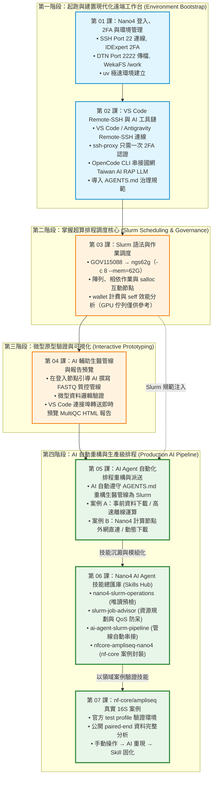
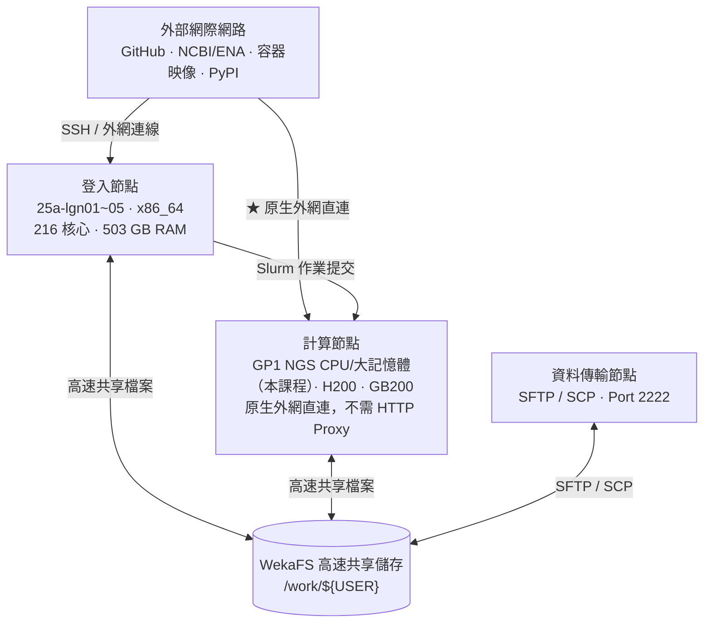

# 晶創26 (Nano4) GP1 生醫 HPC 實戰教學手冊
### —— 以 VS Code (Antigravity) + AI Agent 為核心工作台，從登入到 nf-core 生醫管線的全流程實戰

歡迎來到國網中心**晶創26（Nano4 / `nano4.nchc.org.tw`）GP1 生醫核心設施**實戰教學！本教學專為使用 GP1 NGS 運算節點的生醫研究人員與學生設計，本次課程使用計畫 `GOV115088`、佇列 `ngs62g`（CPU-only）。

> [!IMPORTANT]
> **🚀 現代化超級電腦開發核心理念：本地 VS Code + AI Agent 雙核心工作台 (Unified Cockpit)**  
> 過去使用超級電腦，開發者常陷於「黑底終端機 + Vim + 繁瑣 scp 下載看圖」的低效流程中。  
> 本系列教學全面採用**現代化遠端 IDE 與 AI Agent 協同工作流**：  
> 透過筆電本地端 **VS Code Remote-SSH** 連線至 Nano4 登入節點，在同一個工作台內享有**高階代碼編輯、Git 視覺化版本控制、Jupyter 互動筆記本、AI 程式碼助理（Antigravity / Claude Code / OpenCode）、以及 Slurm 批次排程派送與效能監控**！  
> 更進一步，Nano4 計算節點**可直接連外網**，AI Agent 能在 Slurm 作業中直接下載資料與容器，驅動 FastQC、nf-core 等生醫分析管線。

> [!NOTE]
> **本次課程設定**：計畫 **`GOV115088`**（國網生技醫藥高效能運算推廣與應用計畫），**CPU-only**，所有 Slurm 作業使用 **`ngs62g`** 佇列，並依國網官方規格每個作業固定申請 **`-c 8 --mem=62G`**（最長 4 天）。
> 手冊中的 H200 / GB200 GPU 內容僅供認識叢集架構，本次不操作。

---

## 📚 目錄索引 (Tutorial Index)

> 本課程主體共 **七章（第 01–07 章）**；另附 Nano4 AI Agent 治理守則作為附錄。

| 章節編號 | 教學主題 | 說明與適用場景 | 核心工作台角色 | 快速連結 |
| :---: | :--- | :--- | :--- | :---: |
| **01** | **登入、2FA 與環境管理** | 登入節點連線 (`nano4.nchc.org.tw:22`)、IDExpert 2FA、專屬 DTN 埠號 (`Port 2222`) 傳檔、WekaFS 高速儲存架構 (`/home` vs `/work`) 與極速 Python 套件管理 `uv`。 | **超算地基** 初始化 `$HOME` 與建立 `/work` Python 虛擬環境 | [前往章節](./01-nano4-ssh-and-2fa/) |
| **02** | **VS Code Remote-SSH 與 AI 工具鏈** | 本機 VS Code / Antigravity Remote-SSH 連線設定（搭配 `ssh-proxy` 只需一次 2FA 認證）、整合 OpenCode CLI 串接國網 Taiwan AI RAP 地端大模型，並導入專屬 **`AGENTS.md`** 系統治理規範。 | **開發大腦** 本地 IDE 無縫連線，召喚 AI 助理協同程式設計 | [前往章節](./02-vscode-and-ai-tools/) |
| **03** | **Slurm 語法與作業調度** | 以本課程的 `GOV115088` → `ngs62g`（固定 `-c 8 --mem=62G`）為標準範例，練習 `sbatch`、陣列與相依作業、`salloc` 互動節點、`wallet` 額度與 `seff` 效能分析；H200/GB200 分區僅供參考。 | **調度指揮所** 語法高亮編寫排程、內建終端派送與資源除錯 | [前往章節](./03-slurm-syntax-and-job-management/) |
| **04** | **AI 輔助生醫質控管線** | 以生醫 FASTQ 質控為具象化案例（架構全領域通用），在 VS Code 內引導 AI 編寫分析管線、登入節點微型測試，並透過連接埠轉送在瀏覽器即時預覽 MultiQC 互動報告。 | **微型原型實踐** 小數據原型開發、邏輯驗證與報告即時轉送預覽 | [前往章節](./04-ai-assisted-bio-pipeline/) |
| **05** | **AI Agent 自動化 Slurm 排程** | 引導 AI Agent 將登入節點的分析流程重構為 Slurm 批次作業：實作「事前下載離線運算 (Case A)」與「計算節點外網直連動態下載 (Case B)」兩種架構。 | **全流程自動化** AI 排程重構、直接連網批次運算與成果交付 | [前往章節](./05-ai-agent-slurm-pipeline/) |
| **06** | **AI Agent 技能總匯庫 (Skills Hub)** | 將 Nano4 領域知識打包為 AI Agent 專家技能 (`nano4-slurm-operations`, `slurm-job-advisor`, `ai-agent-slurm-pipeline`, `nfcore-ampliseq-nano4`)，支援 `wallet` 預檢、佇列 QoS 防呆與 `sbatch --test-only` 帳號/分區預檢。 | **專家技能庫** 掛載超算領域專家技能，賦予 AI 即時作戰能力 | [前往章節](./06-skills-hub/) |
| **07** | **nf-core/ampliseq 真實 16S 案例** | 先手動以官方 test profile 驗證環境，再用保留原始 metadata 與 primer 的公開 paired-end 16S 資料完成分析、判讀結果，最後交由 AI 重現並封裝成 Skill。 | **完整案例實戰** 手動操作 → AI 重現 → Skill 固化 | [前往章節](./07-nfcore-ampliseq-case-study/) |
| **附錄** | **HPC 專屬 AI Agent 治理守則 (AGENTS.md)** | 全工作區通用系統守則，規範嚴禁 sudo、WekaFS `/work` 儲存分層、module purge、ngs62g 記憶體限制與日誌萬用命名。 | **系統憲法** 防止 AI 產生危險指令與超算違規行為 | [查看守則](./AGENTS.md) |

---

## 🗺️ 學習路徑與課程相依性 (DAG Roadmap)

本系列手冊以 **VS Code Remote-SSH + AI Agent** 為主軸貫穿四大研發進程：

---

## 🖥️ 晶創26 (Nano4) 硬體與網路架構特徵

GP1 生醫節點（NGS CPU `25a-cpn*`、大記憶體 `25a-mpn*`）是 Nano4 叢集的一部分，與 H200 / GB200 GPU 節點共用登入節點與 `/work` 儲存；本次課程只使用 NGS CPU 節點，GPU 節點僅供參考。Nano4 與傳統超算叢集（如 Taiwania 1 / F1）相比，具備以下特徵：

1. **外網直連能力**：計算節點原生具備外網連線能力，在 Slurm 作業中直接下載 FASTQ（NCBI/ENA）、參考資料庫與容器映像，無需再啟動 Login Node Proxy 守護行程。
2. **高速 WekaFS 儲存**：專用高速磁區掛載於 **`/work/${USER}`**（GOV 計畫預設約 100 GB，實際配額以 `hfsquota` 為準），速度遠超傳統 NFS，請務必將定序資料、參考資料庫、容器快取與虛擬環境建置於此。
3. **專用資料傳輸節點 (DTN)**：檔案傳輸專用通訊埠為 **Port 2222**，透過 SFTP / SCP 傳檔可享有最大頻寬且不干擾登入連線。

---

## 🌐 線上閱讀與 GitHub Pages (Online Documentation)

本教學手冊已整合 VitePress 與 GitHub Actions 自動部署，可直接透過瀏覽器線上閱讀：
* 📖 **線上教學手冊 (GitHub Pages)**：[https://gemini960114.github.io/Nano4-Docs/](https://gemini960114.github.io/Nano4-Docs/)
* 📦 **GitHub 專案原始碼**：[https://github.com/gemini960114/Nano4-Docs](https://github.com/gemini960114/Nano4-Docs)

---

## 🔗 國網中心官方參考技術文件

本教學深度整合了國網中心官方指南與實戰驗證，相關手冊請參閱：
* [GP1 生醫核心設施完整使用說明（官方）](https://man.twcc.ai/xOYzPATVS_aDlbuqMrwhyg)
* [晶創26 (Nano4) 使用者操作手冊 (TWCC / HackMD)](https://man.twcc.ai/@nano4-manual/documentation)
* [晶創26系統架構及規格](https://man.twcc.ai/@nano4-manual/SJuKzVlwbx)
* [Nano4 登入與傳輸節點](https://man.twcc.ai/@nano4-manual/BydP-_lvZg)
* [Nano4 雙因子認證 (2FA) 設定（iService）](https://iservice.nchc.org.tw/nchc_service/nchc_service_qa_single.php?qa_code=774)
* [Nano4 Slurm 佇列與資源規格](https://man.twcc.ai/@nano4-manual/SJM_FuxDWe)
* [Nano4 Slurm Job 提交與管理範例](https://man.twcc.ai/@nano4-manual/BkRXxZ_JMg)
* [Nano4 儲存資源與目錄位置（WekaFS）](https://man.twcc.ai/@nano4-manual/ry1hWDlPbl)
* [Nano4 軟體環境模組（Lmod）基本說明](https://man.twcc.ai/@nano4-manual/BJyI6dgw-g)
