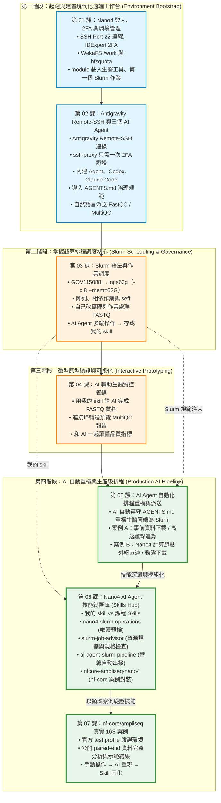
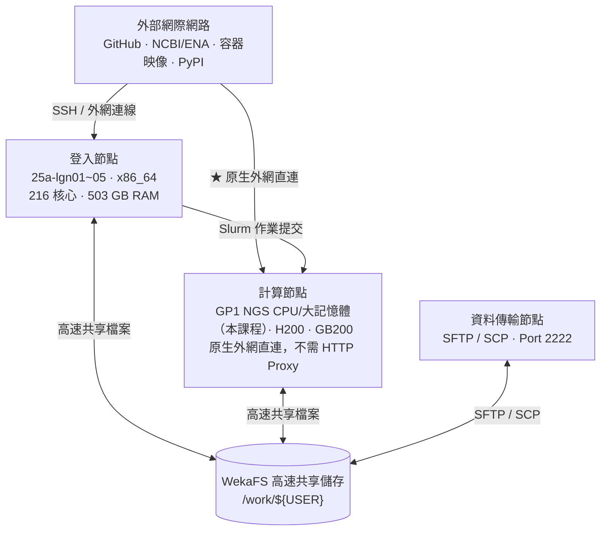

# 晶創26 (Nano4) GP1 生醫 HPC 實戰教學手冊
### —— 以 VS Code (Antigravity) + AI Agent 為核心工作台，從登入到 nf-core 生醫管線的全流程實戰

歡迎來到國網中心**晶創26（Nano4 / `nano4.nchc.org.tw`）GP1 生醫核心設施**實戰教學！本教學專為使用 GP1 NGS 運算節點的生醫研究人員與學生設計，本次課程使用計畫 `GOV115088`、佇列 `ngs62g`（CPU-only）。

> [!IMPORTANT]
> **🚀 現代化超級電腦開發核心理念：本地 VS Code + AI Agent 雙核心工作台 (Unified Cockpit)**  
> 過去使用超級電腦，開發者常陷於「黑底終端機 + Vim + 繁瑣 scp 下載看圖」的低效流程中。  
> 本系列教學全面採用**現代化遠端 IDE 與 AI Agent 協同工作流**：  
> 透過筆電本地端 **VS Code Remote-SSH** 連線至 Nano4 登入節點，在同一個工作台內享有**高階代碼編輯、Git 視覺化版本控制、Jupyter 互動筆記本、AI Agent（Antigravity 內建 Agent / Codex / Claude Code）、以及 Slurm 批次排程派送與效能監控**！  
> 更進一步，Nano4 計算節點**可直接連外網**，AI Agent 能在 Slurm 作業中直接下載資料與容器，驅動 FastQC、nf-core 等生醫分析管線。

> [!NOTE]
> **本次課程設定**：計畫 **`GOV115088`**（國網生技醫藥高效能運算推廣與應用計畫），**CPU-only**，所有 Slurm 作業使用 **`ngs62g`** 佇列，並依國網官方規格每個作業固定申請 **`-c 8 --mem=62G`**（最長 4 天）。
> 手冊中的 H200 / GB200 GPU 內容僅供認識叢集架構，本次不操作。
> 課程分為三堂，每堂 3 小時：**第一堂**連線與 AI Agent（第 01–02 章）、**第二堂** Slurm 與我的 skill（第 03–04 章）、**第三堂**進階與真實案例（第 05–07 章）；各堂時間安排見[課程規劃（講師版）](./course_plan)。
> 貫穿三堂的重點：**用自然語言請 AI Agent 協助完成生醫分析**，而不是自己背誦、輸入困難的指令；您負責確認 Agent 的計畫與結果是否正確。

---

## 📚 目錄索引 (Tutorial Index)

> 本課程主體共 **七章（第 01–07 章）**；另附 Nano4 AI Agent 治理守則作為附錄。

| 章節編號 | 教學主題 | 說明與適用場景 | 核心工作台角色 | 快速連結 |
| :---: | :--- | :--- | :--- | :---: |
| **01** | **登入、2FA 與環境管理** | 登入節點連線 (`nano4.nchc.org.tw:22`)、IDExpert 2FA、專屬 DTN 埠號 (`Port 2222`) 傳檔、WekaFS 高速儲存架構 (`/home` vs `/work`)、以 `module` 載入生醫工具（FastQC / MultiQC / JDK），並送出第一個 `ngs62g` 作業。 | **超算地基** 初始化 `$HOME`、載入生醫模組、第一個 Slurm 作業 | [前往章節](./01_nano4_ssh_and_2fa) |
| **02** | **Antigravity Remote-SSH 與三個 AI Agent** | Antigravity Remote-SSH 連線設定（搭配 `ssh-proxy` 只需一次 2FA 認證）、裝上 Antigravity 內建 Agent、Codex、Claude Code 三個 AI Agent 並比較回答、導入專屬 **`AGENTS.md`** 系統治理規範，最後示範手動 `sbatch` 與自然語言派送 FastQC / MultiQC。 | **開發大腦** 把 AI Agent 帶到超算上 | [前往章節](./02_vscode_and_ai_tools) |
| **03** | **Slurm 語法與作業調度** | 以本課程的 `GOV115088` → `ngs62g`（固定 `-c 8 --mem=62G`）為標準範例，練習 `sbatch`、陣列與相依作業、`salloc` 互動節點、`seff` 效能分析，自己改寫陣列作業逐一處理 FASTQ 樣本；再用自然語言請 AI Agent 多輪完成同樣的工作，並把經驗存成**自己的 skill**（`my-nano4-slurm`）；另有 **Apptainer 容器**（Docker Hub `multiqc/multiqc`）執行 MultiQC 的練習；H200/GB200 分區僅供參考。 | **調度指揮所** 排程、AI 協作與我的 skill | [前往章節](./03_slurm_syntax_and_job_management) |
| **04** | **AI 輔助生醫質控管線** | 以生醫 FASTQ 質控為具象化案例（架構全領域通用），用自己的 skill 請 AI Agent 完成 FastQC / MultiQC，透過連接埠轉送在瀏覽器預覽互動報告，並和 Agent 一起讀懂品質指標；另附登入節點手動執行的對照組。 | **AI 協作分析** 用自己的 skill 完成質控與判讀 | [前往章節](./04_ai_assisted_bio_pipeline) |
| **05** | **AI Agent 自動化 Slurm 排程** | 引導 AI Agent 將登入節點的分析流程重構為 Slurm 批次作業：實作「事前下載離線運算 (Case A)」與「計算節點外網直連動態下載 (Case B)」兩種架構。 | **全流程自動化** AI 排程重構、直接連網批次運算與成果交付 | [前往章節](./05_ai_agent_slurm_pipeline) |
| **06** | **AI Agent 技能總匯庫 (Skills Hub)** | 將 Nano4 領域知識打包為 AI Agent 專家技能 (`nano4-slurm-operations`, `slurm-job-advisor`, `ai-agent-slurm-pipeline`, `nfcore-ampliseq-nano4`)，支援 `wallet` 預檢、`ngs62g` 官方規格檢查，並用 `validate_slurm.sh` 抓出 `sbatch --test-only` 漏掉的錯誤。 | **專家技能庫** 掛載超算領域專家技能，賦予 AI 即時作戰能力 | [前往章節](./06_skills_hub) |
| **07** | **nf-core/ampliseq 真實 16S 案例** | 先手動以官方 test profile 驗證環境，再用保留原始 metadata 與 primer 的公開 paired-end 16S 資料完成分析、判讀結果，最後交由 AI 重現並封裝成 Skill；講師的完整示範結果可從 [GitHub Release](https://github.com/gemini960114/Nano4-Docs/releases/tag/ampliseq-demo-2026-09-23) 下載觀看。 | **完整案例實戰** 手動操作 → AI 重現 → Skill 固化 | [前往章節](./07_nfcore_ampliseq_case_study) |
| **附錄** | **HPC 專屬 AI Agent 治理守則 (AGENTS.md)** | 全工作區通用系統守則，規範嚴禁 sudo、WekaFS `/work` 儲存分層、module purge、ngs62g 記憶體限制與日誌萬用命名。 | **系統憲法** 防止 AI 產生危險指令與超算違規行為 | [查看守則](./agents_governance) |

---

## 🗺️ 學習路徑與課程相依性 (DAG Roadmap)

本系列手冊以 **VS Code Remote-SSH + AI Agent** 為主軸貫穿四大研發進程：

---

## 🖥️ 晶創26 (Nano4) 硬體與網路架構特徵

### 一張圖看懂：從您的筆電到計算節點

1. **使用者 → 登入節點**：用 SSH（`nano4.nchc.org.tw:22`）登入，或用 Antigravity Remote-SSH 連線；在這裡編輯檔案、請 AI Agent 撰寫腳本並送出作業。
2. **登入節點 → Slurm**：以 `sbatch`（批次作業）或 `srun` / `salloc`（互動式）把工作交給 Slurm，由它排隊並分配資源。
3. **Slurm → 計算節點**：本課程的作業都送到 **GP1 生醫 CPU 節點**（`ngs62g`）；H200 GPU 節點需要具 GPU 權限的計畫，本次不使用。

### GP1 生醫核心設施的組成

| GP1 節點 | 規格（每個節點） | 本課程 |
| :--- | :--- | :--- |
| **CPU 節點**（`25a-cpn*`） | 128 cores、約 1000 GB 記憶體 | ✅ `GOV115088` → `ngs62g`，每個作業固定 `-c 8 --mem=62G`（2026-09-23 可排程的節點為 13 台：`25a-cpn[01-10,16-18]`） |
| **H200 GPU 節點**（`25a-hgpn[175-177]`） | 8 × H200 GPU | ❌ 需具 GPU 權限的生醫計畫（`ngs1gpu`～`ngs8gpu`） |
| **大記憶體節點**（`25a-mpn*`，2 台） | 128 cores、約 6000 GB 記憶體 | ❌ 需 `MST109178` 等生醫平台計畫（`ngs1500g`～`ngs6t`） |

右側的 H200 GPU 叢集與 GB200 NVL72 屬於 Nano4 的一般 AI 資源，與 GP1 共用 `/home`、`/work` 儲存，本課程僅供參考。

### 網路與儲存特徵

GP1 生醫節點（NGS CPU `25a-cpn*`、大記憶體 `25a-mpn*`）是 Nano4 叢集的一部分，與 H200 / GB200 GPU 節點共用登入節點與 `/work` 儲存；本次課程只使用 NGS CPU 節點，GPU 節點僅供參考。Nano4 與傳統超算叢集（如 Taiwania 1 / F1）相比，具備以下特徵：

1. **外網直連能力**：計算節點原生具備外網連線能力，在 Slurm 作業中直接下載 FASTQ（NCBI/ENA）、參考資料庫與容器映像，無需再啟動 Login Node Proxy 守護行程。
2. **高速 WekaFS 儲存**：專用高速磁區掛載於 **`/work/${USER}`**（GOV 計畫預設約 100 GB，實際配額以 `hfsquota` 為準），速度遠超傳統 NFS，請務必將定序資料、參考資料庫、容器快取與虛擬環境建置於此。
3. **專用資料傳輸節點 (DTN)**：檔案傳輸專用通訊埠為 **Port 2222**，透過 SFTP / SCP 傳檔可享有最大頻寬且不干擾登入連線。

---

## 🌐 線上閱讀與 GitHub Pages (Online Documentation)

本教學手冊已整合 VitePress 與 GitHub Actions 自動部署，可直接透過瀏覽器線上閱讀：
* 📖 **線上教學手冊 (GitHub Pages)**：[https://gemini960114.github.io/Nano4-Docs/](https://gemini960114.github.io/Nano4-Docs/)
* 📦 **GitHub 專案原始碼**：[https://github.com/gemini960114/Nano4-Docs](https://github.com/gemini960114/Nano4-Docs)

---

## 🔗 國網中心官方參考技術文件

本教學深度整合了國網中心官方指南與實戰驗證，相關手冊請參閱：
* [GP1 生醫核心設施完整使用說明（官方）](https://man.twcc.ai/xOYzPATVS_aDlbuqMrwhyg)
* [晶創26 (Nano4) 使用者操作手冊 (TWCC / HackMD)](https://man.twcc.ai/@nano4-manual/documentation)
* [晶創26系統架構及規格](https://man.twcc.ai/@nano4-manual/SJuKzVlwbx)
* [Nano4 登入與傳輸節點](https://man.twcc.ai/@nano4-manual/BydP-_lvZg)
* [Nano4 雙因子認證 (2FA) 設定（iService）](https://iservice.nchc.org.tw/nchc_service/nchc_service_qa_single.php?qa_code=774)
* [Nano4 Slurm 佇列與資源規格](https://man.twcc.ai/@nano4-manual/SJM_FuxDWe)
* [Nano4 Slurm Job 提交與管理範例](https://man.twcc.ai/@nano4-manual/BkRXxZ_JMg)
* [Nano4 儲存資源與目錄位置（WekaFS）](https://man.twcc.ai/@nano4-manual/ry1hWDlPbl)
* [Nano4 軟體環境模組（Lmod）基本說明](https://man.twcc.ai/@nano4-manual/BJyI6dgw-g)
