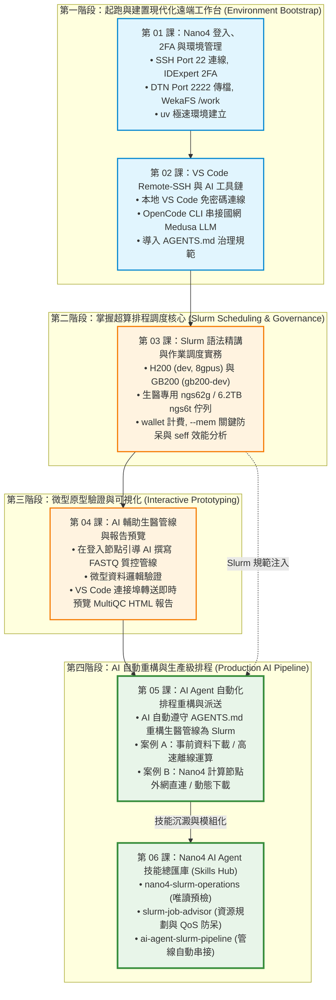

# 晶創26 (Nano4) HPC 實戰教學系列手冊 (課程大綱與導覽)
### —— 以 VS Code Remote-SSH 與 AI Agent 為核心工作台的超級電腦全流程實戰指南

歡迎來到國網中心**晶創26（Nano4 / `nano4.nchc.org.tw`）**超級電腦實戰教學系列手冊！本教學專為在國家高速網路與計算中心（NCHC）最新旗艦級超算環境中的使用者、生醫研究人員與 AI 開發者量身打造。

> [!IMPORTANT]
> **🚀 現代化超級電腦開發核心理念：本地 VS Code + AI Agent 雙核心工作台 (Unified Cockpit)**  
> 過去使用超級電腦，開發者常陷於「黑底終端機 + Vim + 繁瑣 scp 下載看圖」的低效流程中。  
> 本系列教學全面採用**現代化遠端 IDE 與 AI Agent 協同工作流**：  
> 透過筆電本地端 **VS Code Remote-SSH** 連線至 Nano4 登入節點，在同一個工作台內享有**高階代碼編輯、Git 視覺化版本控制、Jupyter 互動筆記本、AI 程式碼助理（OpenCode / Antigravity / Claude Code）、以及 Slurm 批次排程派送與效能監控**！  
> 更進一步，Nano4 計算節點**具備原生外網直連能力**，讓 AI Agent 能無縫驅動大規模生醫與深度學習管線！

---

## 📚 目錄索引 (Tutorial Index)

| 章節編號 | 教學主題 | 說明與適用場景 | 核心工作台角色 | 快速連結 |
| :---: | :--- | :--- | :--- | :---: |
| **01** | **晶創26登入、雙因子認證與環境管理** | 登入節點連線 (`nano4.nchc.org.tw:22`)、IDExpert 2FA、專屬 DTN 埠號 (`Port 2222`) 傳檔、WekaFS 高速儲存架構 (`/home` vs `/work`) 與極速 Python 套件管理 `uv`。 | **超算地基** 初始化 `$HOME` 與建立 `/work` Python 虛擬環境 | [前往章節](./01_nano4_ssh_and_2fa) |
| **02** | **VS Code Remote-SSH 與 AI 開發工具鏈** | 本機 VS Code 免密碼連線設定、整合 OpenCode CLI 串接國網 Medusa 地端大模型、Antigravity CLI，並導入專屬 **`AGENTS.md`** 系統治理規範。 | **開發大腦** 本地 IDE 無縫連線，召喚 AI 助理協同程式設計 | [前往章節](./02_vscode_and_ai_tools) |
| **03** | **Slurm 語法精講與超級電腦作業調度實務** | 全面掌握 Nano4 雙架構分區：H200 (`dev`/`8gpus`)、GB200 NVL72 (`gb200-dev`)、專屬生醫分區 (`ngstest`/`ngs62g`/`ngs6t`)；解析 `wallet` 額度、`--mem` 關鍵防呆與 `seff` 效能分析。 | **調度指揮所** 語法高亮編寫排程、內建終端派送與資源除錯 | [前往章節](./03_slurm_syntax_and_job_management) |
| **04** | **AI 輔助生醫管線 (FASTQ 質控微型實作)** | 以生醫 FASTQ 質控為具象化案例（架構全領域通用），在 VS Code 內引導 AI 編寫分析管線、登入節點微型測試，並透過連接埠轉送在瀏覽器即時預覽 MultiQC 互動報告。 | **微型原型實踐** 小數據原型開發、邏輯驗證與報告即時轉送預覽 | [前往章節](./04_ai_assisted_bio_pipeline) |
| **05** | **AI Agent 自動化排程 (重構生醫管線至 Slurm)** | 【全系列集大成】引導 AI Agent 自動將登入節點分析管線重構為生產級 Slurm 批次作業：實作「事前下載離線運算 (Case A)」與「計算節點外網直連動態下載 (Case B)」雙架構！ | **全流程自動化** AI 排程重構、直接連網批次運算與成果交付 | [前往章節](./05_ai_agent_slurm_pipeline) |
| **06** | **Nano4 AI Agent 技能總匯庫 (Skills Hub)** | 將 Nano4 領域知識打包為 AI Agent 專家技能 (`nano4-slurm-operations`, `slurm-job-advisor`, `ai-agent-slurm-pipeline`)，支援 `wallet` 預檢與 `sbatch --test-only` 防呆。 | **專家技能庫** 掛載超算領域專家技能，賦予 AI 即時作戰能力 | [前往章節](./06_skills_hub) |
| **附錄** | **HPC 專屬 AI Agent 治理守則 (AGENTS.md)** | 全工作區通用系統守則，規範嚴禁 sudo、WekaFS `/work` 儲存分層、module purge、ngs62g 記憶體限制與日誌萬用命名。 | **系統憲法** 防止 AI 產生危險指令與超算違規行為 | [查看守則](./agents_governance) |

---

## 🗺️ 學習路徑與課程相依性 (DAG Roadmap)

本系列手冊以 **VS Code Remote-SSH + AI Agent** 為主軸貫穿四大研發進程：

