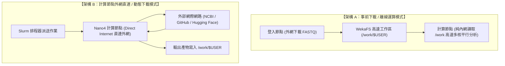

# HPC 實戰指南：AI Agent 自動化 Slurm 排程重構與批次派送實戰 (Nano4 雙實戰案例)

本教學手冊展示如何引導 **AI Agent（OpenCode CLI / Antigravity CLI / Claude Code）**，將前述章節在登入節點執行的互動式生醫分析管線，自動重構並封裝為生產級的 **Slurm 批次排程作業**，同時完整實作 **「事前下載離線運算」** 與 **「計算節點外網直連動態下載」** 兩種關鍵生產環境架構。

---

## 📌 目錄 (Table of Contents)
- [1. 為什麼要將腳本派送至 Slurm 佇列？](#_1-為什麼要將腳本派送至-slurm-佇列)
- [2. 請 AI Agent 自動重構 Slurm 腳本 (Prompt 技巧)](#_2-請-ai-agent-自動重構-slurm-腳本-prompt-技巧)
- [3. Nano4 兩大運算架構對比：離線運算 vs 外網直連](#_3-nano4-兩大運算架構對比-離線運算-vs-外網直連)
- [4. 實戰案例 A：事前資料下載 / 高速離線運算模式](#_4-實戰案例-a-事前資料下載-高速離線運算模式)
- [5. 實戰案例 B：計算節點外網直連 / 動態下載模式](#_5-實戰案例-b-計算節點外網直連-動態下載模式)
- [6. 結果檢驗、效能分析 (seff) 與成果匯總](#_6-結果檢驗、效能分析-seff-與成果匯總)
- [7. Nano4 HPC 實戰全系列 6 大課程總結與進階](#_7-nano4-hpc-實戰全系列-6-大課程總結與進階)

---

## 1. 為什麼要將腳本派送至 Slurm 佇列？

在第 04 章中，我們示範了在登入節點執行小量 FASTQ 質控。然而：
* 登入節點（`25a-lgn01~05`）是多人共用，系統 Cgroups 限制個人 CPU 與記憶體，嚴禁執行長時間或高資源運算。
* 只有將任務打包送入 **Slurm 計算節點 (Compute Node)**，才能申請：
  * **多核心 CPU**（生醫佇列 `ngs62g` 支援 8 核，節點專用 `ngs248c`/`ngs496c` 支援數百核）。
  * **超大容量記憶體**（`ngs62g` 支援 62GB，超大記憶體節點 `ngs6t` 支援高達 **6.2 TB RAM**）。
  * **NVIDIA H200 141GB GPU**（`dev`、`8gpus`）與 **GB200 NVL72**，實現數百個樣品或龐大模型的高度平行處理！

---

## 2. 請 AI Agent 自動重構 Slurm 腳本 (Prompt 技巧)

在 **VS Code Remote-SSH** 中，開啟您安裝好的 AI 助手（如 OpenCode CLI、Antigravity CLI 或 Claude Code）。AI 會自動讀取專案根目錄的 `AGENTS.md` 規範（自動帶入 Nano4 專屬的 `ngs62g`、`--mem=16G`、WekaFS `/work` 規範），您只需輸入具體的重構需求提示詞：

```text
你是一位熟悉國網中心 Nano4 (晶創26) 超級電腦 Slurm 排程器與生物資訊分析的專家。
我原本在登入節點有一個執行 FASTQ 質控分析（FastQC + MultiQC）的互動腳本 `run_fastqc_multiqc.sh`。
現在我希望將這套流程改由 Slurm 佇列派送到 Nano4 計算節點（Compute Node）執行。

請幫我編寫兩個版本的 Slurm 批次作業腳本（符合 Nano4 規格，生醫專案使用 #SBATCH --account=GOV115088 與 --partition=ngs62g，並嚴格加上 #SBATCH --mem=16G 避免 QoS 超限）：

1. 案例 A：事前資料下載 / 離線運算模式 (資料已在 /work 高速目錄就緒，計算節點純內網多核平行處理)。
2. 案例 B：外網直連 / 動態下載模式 (利用 Nano4 計算節點 Direct Internet 存取能力，即時抓取遠端資料並質控)。
```
*(完整提示詞可參考 [`prompts/ai_prompt_convert_to_slurm.md`](https://github.com/gemini960114/Nano4-Docs/blob/main/05-ai-agent-slurm-pipeline/prompts/ai_prompt_convert_to_slurm.md))*

---

## 3. Nano4 兩大運算架構對比：離線運算 vs 外網直連



| 評估項目 | 案例 A：事前下載離線運算 | 案例 B：計算節點外網直連動態下載 |
| :--- | :--- | :--- |
| **外部網路需求** | 計算節點完全不發起連線 | 計算節點直接對外連線 (Direct Internet) |
| **Proxy 需求** | ❌ 完全不需要 | ❌ **Nano4 自帶外網，完全不需要 Proxy** |
| **資料準備時機** | 提交 Slurm 作業前已完整就緒 | Slurm 作業開始執行時由節點內部動態拉取 |
| **最佳適用場景** | 大規模長期定序專案、固定生物參考基因組比對 | 即時動態抓取、模型權重即時下載、日誌推播至 WandB |
| **執行穩定度** | ⭐ 穩定度最高 (不受外部網路波動影響) | 高 (依賴外部伺服器連線順暢) |

---

## 4. 實戰案例 A：事前資料下載 / 高速離線運算模式

### 步驟 1：在登入節點準備好資料
在登入節點執行下載腳本，將資料存入共享目錄：
```bash
cd 05-ai-agent-slurm-pipeline/case_a_offline
bash 01_download_on_login_node.sh
```

### 步驟 2：提交純離線 Slurm 計算作業
```bash
sbatch 02_submit_offline_qc.slurm
```
**Slurm 執行腳本重點解密**：
* 申請生醫佇列：`#SBATCH --partition=ngs62g`
* 指定計費專案：`#SBATCH --account=GOV115088`
* 嚴格指定記憶體：`#SBATCH --mem=16G`（避免超出 QoS 限制）
* 申請 4 個 CPU 核心 (`#SBATCH --cpus-per-task=4`)
* 計算節點從 `/work` 高速儲存目錄讀取 FASTQ，進行多執行緒 FastQC 與 MultiQC 匯總。

---

## 5. 實戰案例 B：計算節點外網直連 / 動態下載模式

在舊型 HPC（如 F1）中，計算節點完全隔離無外網，必須透過複雜的 HTTP Proxy 穿透。**而在 Nano4 超級電腦中，計算節點預設具備 Direct Internet 連網能力！**

### 提交外網直連動態下載與質控作業
```bash
cd 05-ai-agent-slurm-pipeline/case_b_online
sbatch run_online_pipeline.slurm
```

**Slurm 核心關鍵程式碼：**
```bash
# 1. 驗證計算節點對外網路連通性 (無須任何 Proxy)
curl -s -I --connect-timeout 5 https://data.qiime2.org >/dev/null
echo "✅ 外網直連成功！"

# 2. 計算節點內部直接向外網下載資料
curl -sSL "https://data.qiime2.org/..." -o dynamic_sample.fastq.gz

# 3. 下載完成後立即啟動 FastQC 與 MultiQC
multiqc fastqc_out/ -o multiqc_out/
```

---

## 6. 結果檢驗、效能分析 (seff) 與成果匯總

作業提交後，可透過指令監控狀態：
```bash
squeue -u $(whoami)
```
當作業狀態自 `R` (Running) 結束後，即可檢視由計算節點產生的成果日誌：
```bash
# 案例 A 產物:
cat case_a_offline/qc_offline-*.out

# 案例 B 產物:
cat case_b_online/qc_online-*.out
```

**執行效能診斷 (`seff`)**：
```bash
seff <JOB_ID>
```
確認 CPU 利用率與 Memory 峰值，驗證資源分配是否精準合理！

---

## 7. Nano4 HPC 實戰全系列 6 大課程總結與進階

恭喜您！至此整個 **Nano4 HPC 實戰教學系列手冊** 已建立起完整、成體系且符合晶創26最新規範的 6 大核心章節：

```text
┌─────────────────────────────────────────────────────────────┐
│              Nano4 (晶創26) HPC 實戰教學系列手冊 (全 6 章)    │
├─────────────────────────────────────────────────────────────┤
│  01. Nano4 登入與雙因子認證 (SSH 22、IDExpert 2FA、DTN 2222) │
│  02. VS Code Remote-SSH 與 AI 開發工具鏈 (OpenCode/Antigravity)│
│  03. Slurm 語法精講與超級電腦作業調度實務 (H200/GB200/NGS分區)│
│  04. AI 輔助生醫管線 (FASTQ 下載與 FastQC/MultiQC 微型實作) │
│  05. AI Agent 自動化排程 (重構生醫管線至 Slurm：離線 vs 直連)│
│  06. AI Agent 技能庫中心 (Skills Hub：Slurm Advisor/生醫管線)│
└─────────────────────────────────────────────────────────────┘
```

這 6 門課程由淺入深，從**安全遠端連線**、**VS Code Remote AI 開發環境**，到**Slurm 排程器深度掌控**；接著在登入節點完成**生醫管線微型驗證**，並最終引導 **AI Agent 將流程自動重構為生產級 Slurm 批次管線**！

在最後的 **第 06 章** 中，我們將探索專為 AI Agent 設計的 **Skills Hub (技能庫)**，讓您的 AI 助手能自動調度叢集專屬的 Advisor 技能，成為真正能自動排程與維運的超級電腦專家！

👉 **下一課**：[第 06 章：AI Agent 技能庫中心 — Skills Hub 架構與客製擴充指南](./06_skills_hub)
